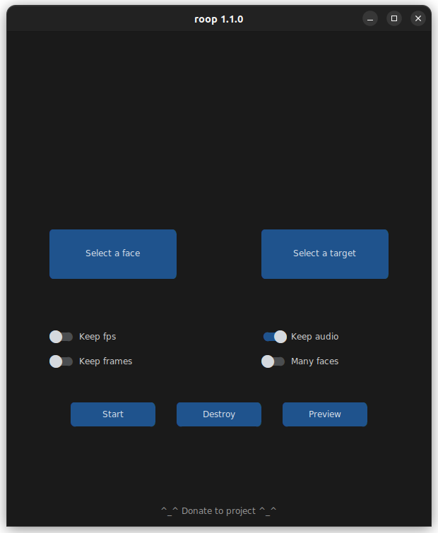

## How do I use it?
> Note: When you run this program for the first time, it will download some models ~300MB in size.

Executing `python run.py` command will launch this window:


Choose a face (image with desired face) and the target image/video (image/video in which you want to replace the face) and click on `Start`. Open file explorer and navigate to the directory you select your output to be in. You will find a directory named `<video_title>` where you can see the frames being swapped in realtime. Once the processing is done, it will create the output file. That's it.

```
options:
  -h, --help                                               show this help message and exit
  -s SOURCE_PATH, --source SOURCE_PATH                     select an source image
  -t TARGET_PATH, --target TARGET_PATH                     select an target image or video
  -o OUTPUT_PATH, --output OUTPUT_PATH                     select output file or directory
  --frame-processor FRAME_PROCESSOR [FRAME_PROCESSOR ...]  frame processors (choices: face_swapper, face_enhancer, ...)
  --keep-fps                                               keep original fps
  --keep-audio                                             keep original audio
  --keep-frames                                            keep temporary frames
  --many-faces                                             process every face
  --video-encoder {libx264,libx265,libvpx-vp9}             adjust output video encoder
  --video-quality [0-51]                                   adjust output video quality
  --max-memory MAX_MEMORY                                  maximum amount of RAM in GB
  --execution-provider {cpu} [{cpu} ...]                   available execution provider (choices: cpu, ...)
  --execution-threads EXECUTION_THREADS                    number of execution threads
  -v, --version                                            show program's version number and exit
```

Looking for a CLI mode? Using the -s/--source argument will make the run program in cli mode.

